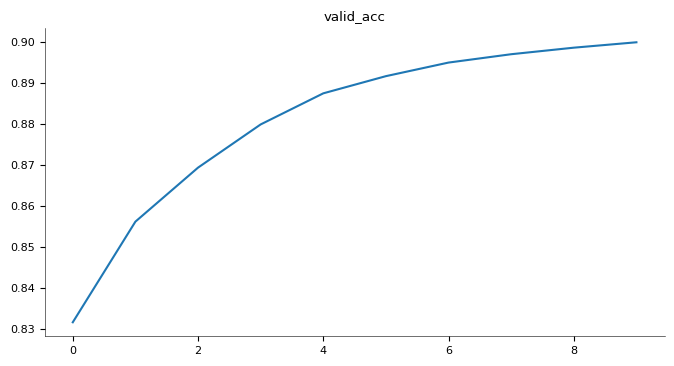

# Sentiment Classification with T5 on IMDB Dataset

This repository contains a simple implementation of sentiment classification on the **IMDB movie reviews dataset** using a **T5-small model**. The code is adapted from the **Homework 1 notebooks of the LLM course by Prof. Rohban et al.**, where we explored different fine-tuning strategies for large language models (LLMs).

---

## Overview

We experimented with three main scenarios:

1. **Zero-Shot - unconstrained output:**  
   The pre-trained T5 model predicts without any constraints. It can generate any text, not limited to "positive" or "negative".  
   - **Accuracy:** ~0% (random, meaningless outputs)  
   - **Example predictions:**
     ```
      Sample 1:
      Review : worth the entertainment value of a rental, especially if you like action movies...
      True : negative
      Pred : the movie,
      
      Sample 2:
      Review : i turned over to this film in the middle of the night...
      True : positive
      Pred : : 8
      
      Sample 3:
      Review : to think this film was made the year i was born...
      True : positive
      Pred : punishment park is
      
      Sample 4:
      Review : "in the sweltering summer of 1958, the deuces, a gang of brooklyn toughs...
      True : negative
      Pred : a
      
      Sample 5:
      Review : i would have given this film a one star vote...
      True : negative
      Pred : a
     ```


2. **Zero-Shot - constrained to "negative" or "positive":**  
   Here we forced the model to only predict one of the two labels by comparing the **softmax probability of the first token** corresponding to "positive" and "negative".  
   - **Accuracy:** 75.55%  
   - **Example predictions:**
     ```
      Sample 1:
      Review : worth the entertainment value of a rental, especially if you like action movies...
      True : negative
      Pred : positive
      
      Sample 2:
      Review : i turned over to this film in the middle of the night...
      True : positive
      Pred : : positive
      
      Sample 3:
      Review : to think this film was made the year i was born...
      True : positive
      Pred : negative
      
      Sample 4:
      Review : "in the sweltering summer of 1958, the deuces, a gang of brooklyn toughs...
      True : negative
      Pred : negative
      
      Sample 5:
      Review : i would have given this film a one star vote...
      True : negative
      Pred : positive
     ```

3. **Full Fine-Tuning (10 epochs):**  
   The T5 model is fine-tuned on the IMDB training dataset for 10 epochs using cross-entropy loss.  
   - **Accuracy:** 90.00%  
   - **Example predictions:**
     ```
      Sample 1:
      Review : worth the entertainment value of a rental, especially if you like action movies...
      True : negative
      Pred : negative
      
      Sample 2:
      Review : i turned over to this film in the middle of the night...
      True : positive
      Pred : : positive
      
      Sample 3:
      Review : to think this film was made the year i was born...
      True : positive
      Pred : postive
      
      Sample 4:
      Review : "in the sweltering summer of 1958, the deuces, a gang of brooklyn toughs...
      True : negative
      Pred : positive
      
      Sample 5:
      Review : i would have given this film a one star vote...
      True : negative
      Pred : negative
     ```

---

## Training Results

The training and validation results for each epoch are summarized below:

| Epoch | Train Loss | Validation Accuracy |
|-------|------------|-------------------|
| 0     | 1.7465     | 0.83156           |
| 1     | 0.2042     | 0.85616           |
| 2     | 0.1766     | 0.86936           |
| 3     | 0.1634     | 0.87992           |
| 4     | 0.1546     | 0.88752           |
| 5     | 0.1462     | 0.89172           |
| 6     | 0.1410     | 0.89504           |
| 7     | 0.1363     | 0.89708           |
| 8     | 0.1328     | 0.89868           |
| 9     | 0.1279     | 0.90000           |

The **validation accuracy vs. epochs** plot is included below:

  

---

## Jupyter Notebook

The full implementation is available in the Jupyter notebook file:  

**[FullFineTune.ipynb](https://colab.research.google.com/drive/1EoVTaAf5U4qbAiGgG3CKxjX7tvclns69?usp=sharing)**  
**[ZeroShot.ipynb](https://colab.research.google.com/drive/1k_0Chg4HEGXrWl67zAQnsC2Z6lU2066G?usp=sharing)**  


This notebook contains:  
- Data preprocessing and tokenization using HuggingFace `datasets` and `T5TokenizerFast`  
- Zero-shot inference (unconstrained and forced to positive/negative)  
- Full fine-tuning of T5 for sentiment classification  
- Visualization of training loss and validation accuracy  


## Additional Experiments: Parameter-Efficient Fine-Tuning

We also explored **soft prompts, adapters, and LoRA**, which allow training **only a small fraction of the parameters**.

---

### **1. Soft Prompt - Manual from Scratch**
The full implementation is available in the Jupyter notebook file:  
**[SoftPromptManual.ipynb](https://colab.research.google.com/drive/14WlngZefnF3VlA-X6bsVZGqVFM9ZzniH?usp=sharing)**  

- **Total parameters:** 60,511,744  
- **Trainable parameters (soft prompts only):** 5,120  
- **Best validation accuracy:** 86.8%  
- **Notes:**  
  - Soft prompts manually initialized and learned.  
  - Lightweight approach with frozen main model weights.

---

### **2. Soft Prompt - Using OpenDelta**
The full implementation is available in the Jupyter notebook file:  
**[SoftPromptOpenDelta.ipynb](https://colab.research.google.com/drive/1EN85aCMWFlpAr1LMHm6CY25pfqZrnGbv?usp=sharing)** 

**2.1 n_tokens = 10**  
- **Total parameters:** 60,511,744  
- **Trainable parameters:** 5,120  
- **Best validation accuracy:** 87.1%  
- **Notes:**  
  - Automated prompt initialization via OpenDelta.  
  - Slight improvement over manual prompts.

**2.2 n_tokens = 1**  
- **Total parameters:** 60,511,744  
- **Trainable parameters:** 512  
- **Best validation accuracy:** not calculated yet  
- **Notes:**  
  - Extremely lightweight prompt tuning.  
  - Expected performance slightly lower due to reduced prompt capacity.

---

### **3. Adapter - Manual from Scratch**
The full implementation is available in the Jupyter notebook file:  
**[Adaptre.ipynb](https://colab.research.google.com/drive/1XEko-ZogYDI4EabeoCTQCogE9hB-wXPe?usp=sharing)** 

- **Total parameters:** not calculated yet  
- **Trainable parameters (adapter only):** not calculated yet  
- **Best validation accuracy:** not calculated yet  
- **Notes:**  
  - Pfeiffer-style adapters inserted after feedforward layers.  
  - Only adapters are trained, keeping main T5 weights frozen.

---

### **4. Adapter - Using AdapterHub**
- **Total parameters:** not calculated yet  
- **Trainable parameters (adapter only):** not calculated yet  
- **Best validation accuracy:** not calculated yet  
- **Notes:**  
  - Pre-built adapters from AdapterHub.  
  - Simplifies insertion and training.

---

### **5. LoRA (Low-Rank Adaptation)**
- **Total parameters:** not calculated yet  
- **Trainable parameters (LoRA only):** not calculated yet  
- **Best validation accuracy:** not calculated yet  
- **Notes:**  
  - Injects low-rank matrices into attention weights.  
  - Only LoRA layers are trained; main model weights are frozen.  
  - Efficient parameter tuning alternative to full fine-tuning.

---

### **Summary Table (All Methods)**

| Method | Total Parameters | Trainable Parameters | Best Accuracy | Notes |
|--------|----------------|-------------------|---------------|-------|
| Zero-Shot (unconstrained) | 60,511,744 | 0 | ~0% | T5 used as-is |
| Zero-Shot (constrained: positive/negative) | 60,511,744 | 0 | 75.55% | First-token probability selection |
| Full Fine-Tuning (10 epochs) | 60,511,744 | 60,511,744 | 90.0% | All parameters trained |
| Soft Prompt - Manual | 60,511,744 | 5,120 | 86.8% | Manual initialization |
| Soft Prompt - OpenDelta (n_tokens=10) | 60,511,744 | 5,120 | 87.1% | Automated soft prompt tuning |
| Soft Prompt - OpenDelta (n_tokens=1) | 60,511,744 | 512 | not calculated | Extremely lightweight |
| Adapter - Manual | not calculated | not calculated | not calculated | Pfeiffer-style adapter |
| Adapter - AdapterHub | not calculated | not calculated | not calculated | Pre-built adapter configs |
| LoRA | not calculated | not calculated | not calculated | Low-rank updates in attention |


     

